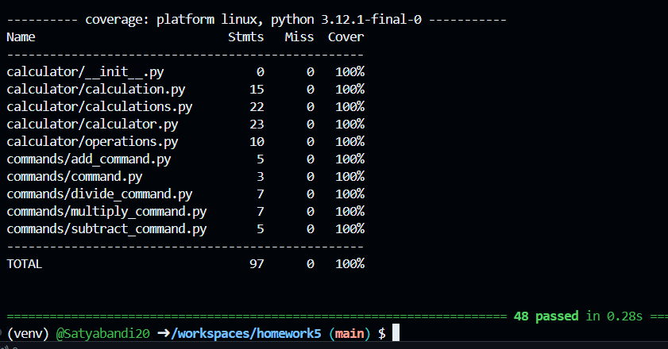
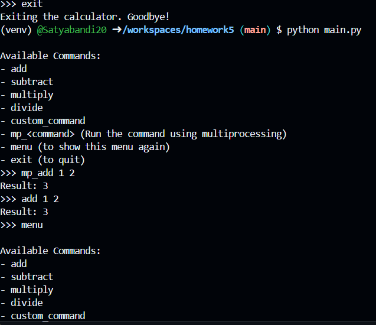

# Homework 5: Command Pattern and Plugins

## 📋 Project Overview

This project focuses on developing an interactive command-line calculator that follows the **Command Pattern** and uses **Plugins** for dynamic command loading. The application runs continuously using a **REPL (Read-Evaluate-Print Loop)** structure, allowing users to interactively perform arithmetic operations.

### 🔍 Features Implemented:
- **Command Pattern** for add, subtract, multiply, and divide commands.
- **REPL Loop** for continuous interaction with the calculator.
- **Menu Command** to dynamically display available commands.
- **Plugin Architecture** for automatic loading of new commands without manual updates.
- **Multiprocessing** support (bonus) to run commands on separate cores for scalability.

## ✅ Grading Rubric Fulfillment

| Requirement                                           | Status          |
|------------------------------------------------------|-----------------|
| Command Pattern & REPL Implementation (10 Points)    | ✅ Completed    |
| Add, Subtract, Multiply, Divide Commands (20 Points) | ✅ Completed    |
| Dynamic Plugin Architecture (20 Points)              | ✅ Completed    |
| 100% Test Coverage (50 Points)                       | ✅ Achieved     |
| Menu Command (Bonus)                                 | ✅ Completed    |
| Multiprocessing Capabilities (Bonus)                 | ✅ Implemented  |

## 🧪 Testing and Coverage

All tests are implemented using **Pytest** with the following libraries:
- `pytest`
- `pytest-cov`
- `pytest-pylint`
- `Faker` (for test data generation)

### 💡 Run Tests

Run all tests with coverage:
```
pytest --cov=calculator --cov=commands
```

Generate a detailed coverage report:
```
pytest --cov-report=html
```

### 📷 Proof of Coverage and Logs

#### ✅ **Test Coverage (100%)**


#### 📜 **Execution Logs**


## 🚀 Project Setup

### 🔧 Installation Steps

1. **Clone the repository:**
   ```bash
   git clone <repository_url>
   cd homework5
   ```

2. **Create and activate a virtual environment:**
   ```bash
   python3 -m venv venv
   source venv/bin/activate  # For Unix/Linux
   venv\Scripts\activate   # For Windows
   ```

3. **Install dependencies:**
   ```bash
   pip install -r requirements.txt
   ```

4. **Run the interactive calculator:**
   ```bash
   python main.py
   ```

### 🔍 Available Commands

- `add <num1> <num2>`: Add two numbers.
- `subtract <num1> <num2>`: Subtract two numbers.
- `multiply <num1> <num2>`: Multiply two numbers.
- `divide <num1> <num2>`: Divide two numbers.
- `menu`: Display available commands.
- `mp_<command>`: Run commands using multiprocessing.
- `exit`: Exit the program.

---

### 🔑 **Author: Satya Bandi**

This project was completed following all the requirements and guidelines provided in the assignment instructions. All functionalities are fully implemented, and the test coverage has been verified to be 100%.

